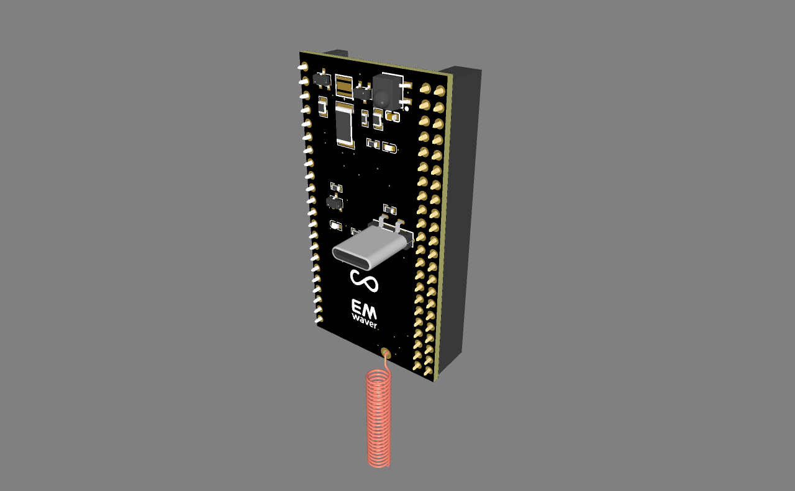

# EMWaver Shield

EMWaver Shield is a shield-style carrier board for an ESP32-S3 module in the EMWaver hardware family.

This repository is the hardware home for the board: design files, manufacturing assets, board notes, images, and release artifacts that help people understand or reproduce the hardware.

It is intentionally not the software source of truth for EMWaver. Firmware, app integration, provisioning, and platform logic live in the private EMWaver product repositories.

## Status

- Private pre-launch repository.
- Hardware-focused repository.
- EMWaver apps remain the primary software distribution path.

## What belongs here

- PCB and schematic source files.
- Manufacturing exports such as Gerbers, pick-and-place, and BOMs.
- Board revision notes and assembly guidance.
- Images, renders, and hardware-facing documentation.
- Optional convenience binaries or recovery artifacts, when useful.

## What does not belong here

- Private EMWaver application code.
- Private backend, provisioning, or minting logic.
- Internal firmware source or other non-public software.
- Product-internal platform documentation that belongs in the main EMWaver repo.

## Board summary

Current direction for EMWaver Shield:

- Shield-style board for an ESP32-S3 DevKit-class module.
- IR receiver and IR LED support.
- USB-oriented EMWaver workflow.
- Footprint/support for an RFM69HW radio module with helical antenna.
- Large duplicated GPIO breakout intended for prototyping and expansion.

## Repository layout

- `hardware/` - board files, exports, and revision-specific hardware material.
- `docs/` - hardware-facing notes, assembly guidance, and public documentation drafts.
- `assets/` - images, renders, and presentation material.

## Release posture

If binaries are published here, they are convenience artifacts only. The normal user path is through EMWaver apps, which manage activation, updates, and the supported software experience.

## Relationship to EMWaver

EMWaver Shield is one hardware surface in the broader EMWaver platform. Users should experience it through the unified EMWaver apps rather than through a manual firmware workflow.
