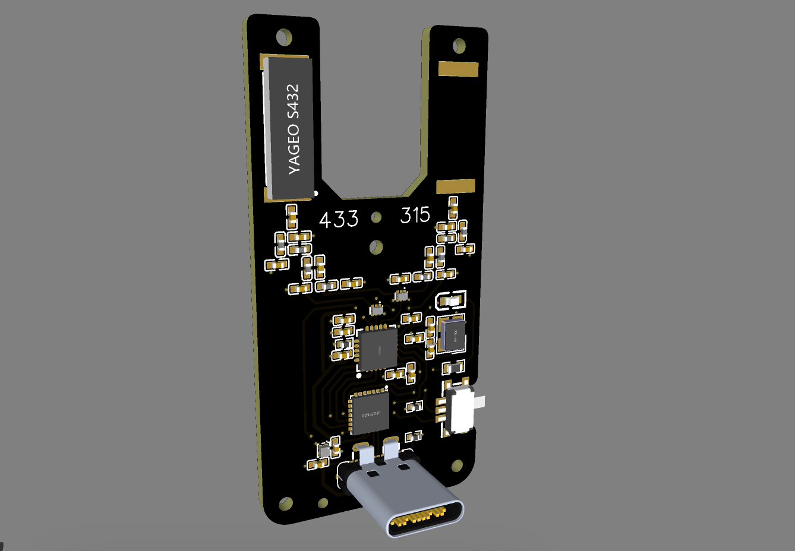

# ISM Waver

ISM Waver is a dual-band ISM board built around the STM32F042 with CC1101 radio support and native USB.

This private repository starts as the device home for ISM Waver hardware material. The current thumbnail mirrors the image used by the EMWaver web build catalog.
