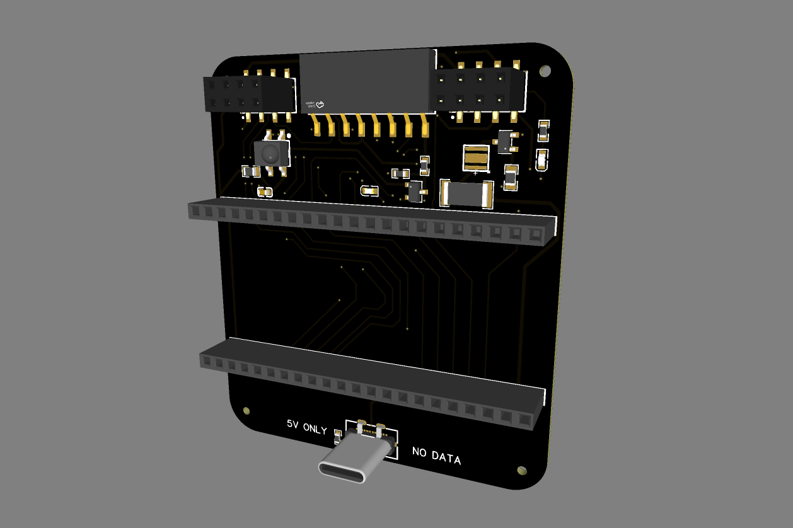

# EMWaver Carrier

EMWaver Carrier is the bring-your-own-MCU EMWaver board. It lets you assemble an EMWaver-compatible device around your own ESP32-S3 module and radio module, with IR support and USB-C for power, programming, and USB communication.

This private repository starts as the device home for EMWaver Carrier hardware material. The current thumbnail mirrors the image used by the EMWaver web build catalog.

Current hardware files live at the repo root next to this README.
The mirrored web catalog package lives under `catalog/`.
