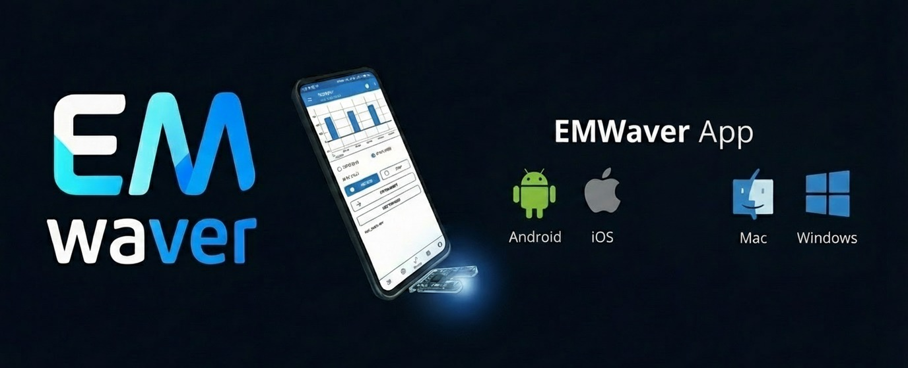

  

  

    <a href="https://luispl77.github.io/emwaver/"><strong>Website</strong></a> ·
    <a href="https://www.youtube.com/@EMWavers"><strong>YouTube</strong></a> ·
    <a href="https://github.com/luispl77/emwaver/releases"><strong>Releases</strong></a>
  

EMWaver is a hardware hacking platform that treats your phone and PC as part of the “device”.

**Current direction:** EMWaver is now centered around a single current-gen **STM32** device using **USB** as the one transport across iOS/Android/Desktop. The product is intentionally **Script-first**: scripts + UI evolve without reflashing.

> Distribution is **binary-first** (apps + firmware shipped as binaries). End users should not need to build or flash from source to use EMWaver.

## Get Started

  
  
  

## Apps & Tools

- Android app: `android/`
- iOS app: `ios/`
- macOS app: `macos/`
- Shared Apple code (iOS + macOS): `apple/`
- Shared Rust crates: `crates/`
- Internal tooling (not shipped): `cli/`

## Firmware

- STM32 firmware (single firmware): `stm/emwaver-firmware/`

## Website

- Next.js site: `frontend/` (run `cd frontend && npm run dev`)

## License

See `LICENSE` and `NOTICE`.
