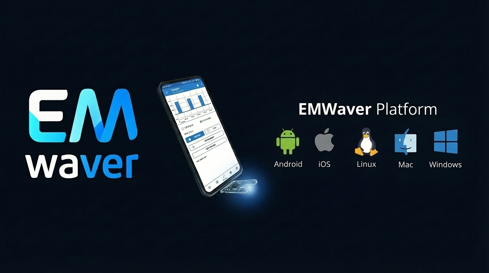

  

  

EMWaver is a multi-target project (ESP32-S3 firmware, companion apps, and tooling). Full docs: https://docs.emwaver.com.

## Firmware (ESP32-S3)

- ESP-IDF setup + build/flash tutorial: `esp/README.md`
- BLE Waver Dongle USB↔BLE adapter firmware: `adapter/`

## Apps & Tools

- Android app: `android/`
- iOS app: `ios/`
- Desktop app: `app/`
- CLI: `cli/`

## License

This project is open source and available under the `LICENSE` file.
