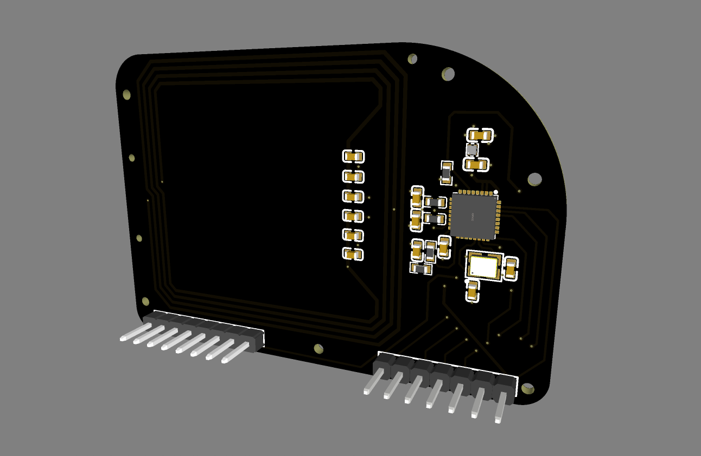

# RFID Waver

RFID Waver is an add-on RFID module intended to pair with GPIO Waver for MFRC522-based 13.56 MHz read and write workflows.

This private repository starts as the device home for RFID Waver hardware material. The current thumbnail mirrors the image used by the EMWaver web build catalog.
