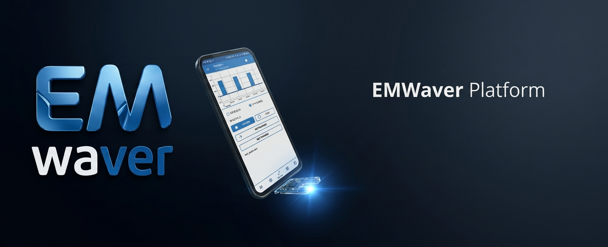

# EMWaver

<p align="center">
  <a href="https://continualmi.com">
    
  </a>
</p>

<p align="center">
  <strong>Zero-compile electronics scripting for phones, desktops, and supported MCU boards.</strong>
</p>

<p align="center">
  <a href="https://emwaver.ai">Website</a> ·
  <a href="https://emwaver.ai/docs">Documentation</a> ·
  <a href="https://emwaver.ai/install">Install</a> ·
  <a href="https://emwaver.ai/build">Supported hardware</a> ·
  <a href="https://continualmi.com">Continual MI</a>
</p>

<p align="center">
  
</p>

EMWaver turns supported MCU boards into a scriptable hardware lab. Write JavaScript, press run, and talk to real electronics from native apps without rebuilding firmware for every experiment.

The core runtime is local-first: scripts run on your device and supported boards are controlled through USB, BLE, and Wi-Fi transports. USB-C gives direct plug-in control, BLE enables cable-free mobile use, and Wi-Fi can support LAN/VPN-style remote hardware control for boards designed around it. The hardware direction is mobile-first too: compact USB-C male boards can plug directly into modern phones, tablets, and laptops for a portable lab that goes far beyond fixed-purpose handheld tools.

> Status: EMWaver is in an early open-source platform release. The architecture is working across the native apps, while packaging, documentation, supported-board coverage, and installer polish are still improving.

## Why EMWaver

Embedded development often means setting up toolchains, compiling firmware, flashing boards, and repeating that loop for every small hardware experiment. EMWaver moves the iteration loop into local scripts, closer to the speed of a software REPL than the usual edit-build-flash cycle.

Scripts can also define instant interfaces for connected modules, so a single file can probe hardware, expose controls, visualize state, and exercise the full feature set of a device:

```jsx
export default function CC1101Panel() {
  const [partnum, setPartnum] = useState("--");

  async function readPartnum() {
    const reply = await spi_transfer([0x80 | 0x30, 0x00]);
    setPartnum(`0x${reply[1].toString(16)}`);
  }

  return (
    <panel title="CC1101">
      <text>PARTNUM: {partnum}</text>
      <button onPress={readPartnum}>Read register</button>
    </panel>
  );
}
```

Use EMWaver when you want to:

- explore sensors, radios, GPIO, SPI, I2C, ADC, and board peripherals quickly;
- run repeatable hardware scripts from a phone, tablet, or desktop;
- control hardware directly from native apps;
- use native apps instead of asking every user to install an MCU toolchain;
- iterate faster than traditional Arduino-style edit-build-flash workflows;
- build instant UI panels for modules directly from scripts;
- carry a compact USB-C hardware lab that plugs directly into phones, tablets, and laptops;
- use BLE for cable-free sessions and Wi-Fi for networked or remote hardware control;
- connect MCP clients to local desktop hardware tools when the user enables Desktop MCP.

## Platform

EMWaver ships native app surfaces for:

- Android
- iOS / iPadOS
- macOS
- Windows
- Linux preview, in progress

The platform is designed around:

- local JavaScript scripts (`.emw`) with JSX-style UI syntax;
- managed board firmware;
- USB as a first-class transport;
- BLE and Wi-Fi for board classes that support them;
- STM32, ESP32-family, and Arduino-compatible firmware targets;
- shared example scripts under [`assets/default-scripts/`](assets/default-scripts/).

A current cross-platform validation path is `cc1101.emw`, which exercises register-level reads and writes against a CC1101 radio through supported hardware.

## Hardware

EMWaver is not one fixed device. The repository includes nine hardware designs for different form factors and capabilities, from compact USB-C controllers to radio, infrared, GPIO, RFID, and ESP32-S3 wireless builds.

See the public build page for the hardware catalog:

- [emwaver.ai/build](https://emwaver.ai/build/)

The hardware sources live under [`hardware/`](hardware/):

- EMWaver Air — ESP32-S3 all-in-one wireless board with CC1101-class radio, IR, and expansion
- EMWaver Carrier — ESP32-S3 DevKit carrier for modular builds
- EMWaver Core — compact STM32 USB control board
- EMWaver Link — integrated STM32 USB radio board
- EMWaver Shield — ESP32-S3 shield-style prototyping board
- GPIO Waver — GPIO, SPI, UART, and I2C prototyping board
- Infrared Waver — IR capture and replay board
- ISM Waver — sub-GHz ISM / CC1101 board
- RFID Waver — 13.56 MHz RFID add-on

Each hardware folder can include schematics, PCB previews, Gerbers, BOMs, pick-and-place files, and case files where available.

## Repository Map

```text
android/                 Android app
ios/                     iPhone and iPad app
macos/                   macOS app
windows/                 Windows 11 app
linux/                   Linux app port, in progress
apple/                   Shared Swift package used by iOS and macOS
stm/                     STM32 firmware workspace
esp/                     ESP32 firmware workspace
arduino/                 Arduino-compatible USB Serial firmware sketches
firmware/                Bundled firmware payloads consumed by apps
assets/default-scripts/  Bundled example .emw scripts and emw-* libraries
simulator/               Shared simulator and protocol fixtures
hardware/                Imported hardware design repositories
crates/                  Rust firmware/update helper crates
tools/                   Build and firmware support tooling
videos/                  Video planning and launch media notes
web/                     Static website sources and exports
```

## Getting Started

For users:

1. Choose a supported board from the [hardware catalog](https://emwaver.ai/build).
2. Install an app from the [install page](https://emwaver.ai/install):
   - [iPhone and iPad on the App Store](https://apps.apple.com/us/app/emwaver/id6747035939)
   - Android through Google Play internal testing or the direct [Android APK](https://github.com/continualmi/emwaver/releases/latest/download/EMWaver-android.apk)
   - [macOS DMG](https://github.com/continualmi/emwaver/releases/latest/download/EMWaver-macos.dmg)
   - [Windows installer](https://github.com/continualmi/emwaver/releases/latest/download/EMWaverSetup-windows-x64.exe) or [Windows ZIP with `EMWaver.exe`](https://github.com/continualmi/emwaver/releases/latest/download/EMWaver-windows-x64.zip)
   - [Linux DEB preview](https://github.com/continualmi/emwaver/releases/latest/download/EMWaver-linux-amd64.deb)
3. Connect a supported board.
4. Open or write a JavaScript hardware script and run it locally.

For local development:

```bash
git clone https://github.com/continualmi/emwaver.git
cd emwaver
```

Then pick your platform and read the closest README:

| Platform | Quick start |
|----------|-------------|
| macOS | Open `macos/EMWaver/EMWaver.xcodeproj` in Xcode → Run |
| iOS | Open `ios/EMWaver.xcodeproj` in Xcode → Run on simulator or device |
| Android | `cd android && ./gradlew assembleDebug` (or open in Android Studio) |
| Windows | Open `windows/EMWaver.sln` in Visual Studio 2022 → Build & Run |
| Linux | `cargo run --manifest-path linux/Cargo.toml -p emwaver-linux-app` |

See [CONTRIBUTING.md](CONTRIBUTING.md) for detailed setup instructions, testing, and contribution guidelines.

Key subsystem READMEs:

- [docs/RELEASES.md](docs/RELEASES.md) for release workflows and public preview assets
- [android/README.md](android/README.md)
- [ios/README.md](ios/README.md)
- [macos/README.md](macos/README.md)
- [windows/README.md](windows/README.md)
- [linux/README.md](linux/README.md)
- [stm/README.md](stm/README.md)
- [esp/README.md](esp/README.md)
- [hardware/README.md](hardware/README.md)
- [docs/RELEASES.md](docs/RELEASES.md)
- [CONTRIBUTING.md](CONTRIBUTING.md)

## Local-First Design

EMWaver's normal hardware-control path is:

```text
native app
  -> local script runtime
  -> local transport
  -> supported board firmware
  -> electronics
```

Scripts and hardware control run locally by default.

Wi-Fi-capable boards can also be controlled over a local network or through user-owned remote access such as VPN, Tailscale, SSH tunneling, or port forwarding.

## Desktop MCP Hardware Interface

Desktop apps expose a local, user-enabled MCP bridge backed by the same script engine and hardware interface exposed to scripts: `run_script`, `list_scripts`, `read_script`, `write_script`, `stop_script`, `device_state`, `spi_transfer`, GPIO reads/writes, analog reads, and board/module probes.

The local scripting and hardware-control path remains useful without MCP enabled. MCP access is local, desktop-only, token-protected, and user-controlled; scripts and device control remain local by default. Open the `MCP` button in the macOS, Windows, or Linux desktop app to enable the server and copy the endpoint/token.

Mobile apps keep local script import, app-local storage, and local script execution, but they do not host an MCP endpoint.

## Documentation

User documentation lives on the EMWaver website:

- [emwaver.ai/docs](https://emwaver.ai/docs/)

Repository docs are mainly for contributors working on apps, firmware, hardware, tests, and release engineering. Start with the README closest to the subsystem you are changing.

## Contributing

Contributions are very welcome. See [CONTRIBUTING.md](CONTRIBUTING.md) for setup instructions, testing, and contribution guidelines.

EMWaver is open source and local-first. Contributions should preserve these principles:

- local scripts and hardware control should keep working offline/local-first;
- scripts should stay local by default;
- normal users should not need to build or flash firmware manually for everyday scripting;
- behavior changes should update the relevant README or documentation file.

Before larger changes, read [AGENTS.md](AGENTS.md) and the README for the subsystem you are touching.

## Support EMWaver

EMWaver is Continual MI's open-source electronics project. If EMWaver helps you, you can support continued development through GitHub Sponsors:

[Sponsor EMWaver](https://github.com/sponsors/continualmi)

Funds go to Continual MI LLC and are used to support EMWaver development.

## License

EMWaver is licensed under the [Apache License 2.0](LICENSE). See [NOTICE](NOTICE) for copyright attribution.
