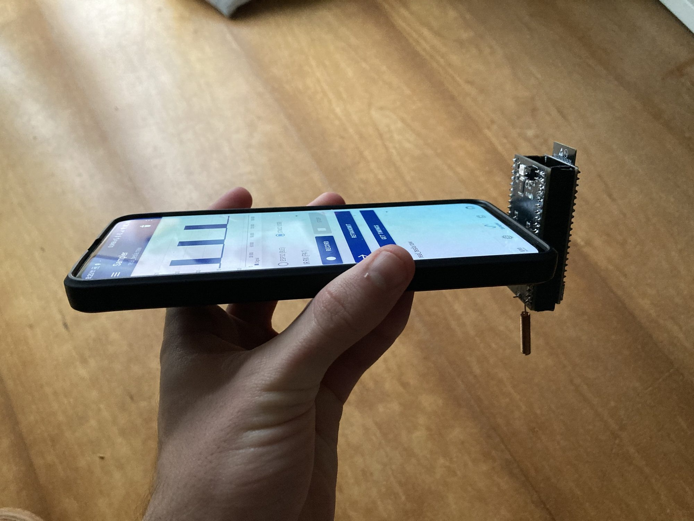
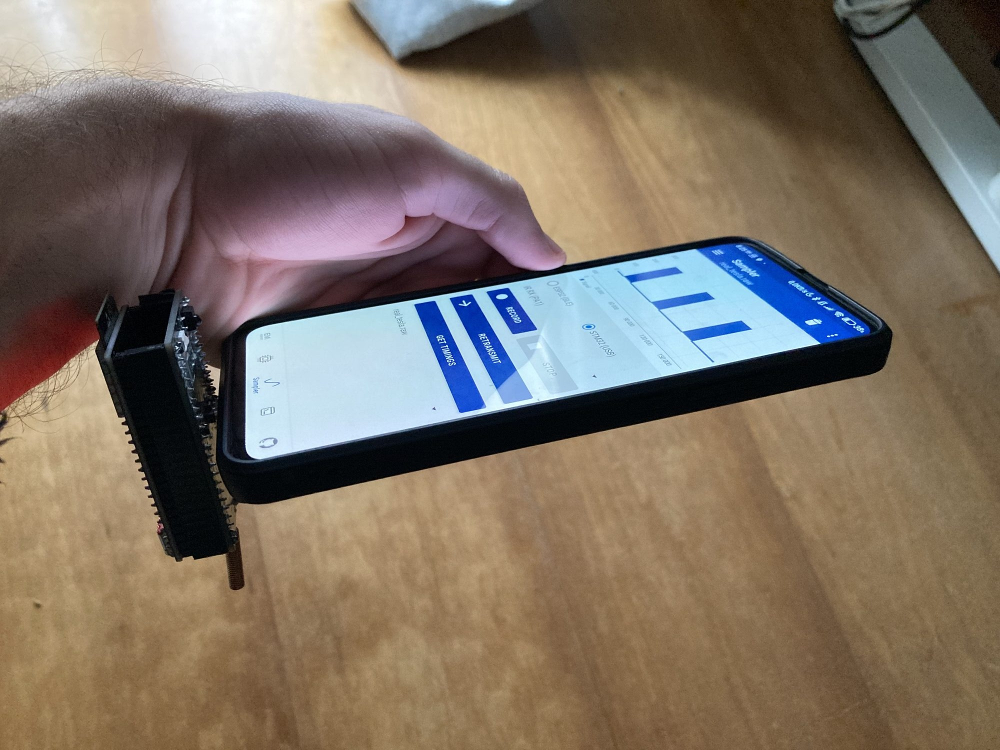

# EMWaver Shield Build Guide

EMWaver Shield is a shield-style carrier board for an ESP32-S3 module in the EMWaver hardware family.

  
  

This repository is primarily a build guide and hardware package for reproducing the board. It exists to collect the shield's public-facing hardware materials in one place: photos, catalog metadata, build notes, and design references.

EMWaver apps remain the normal software path. This repo is not the source of truth for private app, backend, provisioning, or internal firmware source.

## Start here

- [docs/guides/build-guide.md](docs/guides/build-guide.md) - practical builder flow.
- [docs/reference/parts.md](docs/reference/parts.md) - parts and tools checklist.
- [docs/reference/design-sources.md](docs/reference/design-sources.md) - current OSHWLab and EasyEDA references.
- [catalog/device.json](catalog/device.json) - mirrored shield catalog metadata from the main EMWaver repo.

## Build at a glance

1. Review the required parts and decide whether you are building the full radio-capable configuration.
2. Open the linked design sources and export the fabrication files you need if local manufacturing assets are not yet committed here.
3. Order the PCB and parts.
4. Assemble the board, including the ESP32-S3 DevKit carrier and the optional/target radio hardware.
5. Use the EMWaver apps for the software side rather than a manual firmware workflow.

## Current board direction

- Shield carrier for an ESP32-S3 DevKit-class module.
- IR receiver and IR LED support.
- USB-C oriented EMWaver workflow.
- RFM69HW radio module footprint with helical antenna support.
- Large duplicated GPIO breakout intended for prototyping and expansion.
- App support listed in the current catalog metadata: Android, iOS, and desktop.

## Current repo contents

- `catalog/` mirrors the current `EMWAVER_SHIELD` entry from the EMWaver web hardware catalog, including all photos and the device manifest.
- `docs/` contains the builder-facing guide, parts checklist, and design-source references.
- `hardware/` is where revision-specific source files and manufacturing exports should live as they are brought into the repo.
- `assets/` is reserved for presentation material that is not part of the mirrored catalog package.

## Build status

The current source material available in-repo is the catalog package plus external design links. Manufacturing exports and local revision source files still need to be added here as the hardware package is filled out.

  

