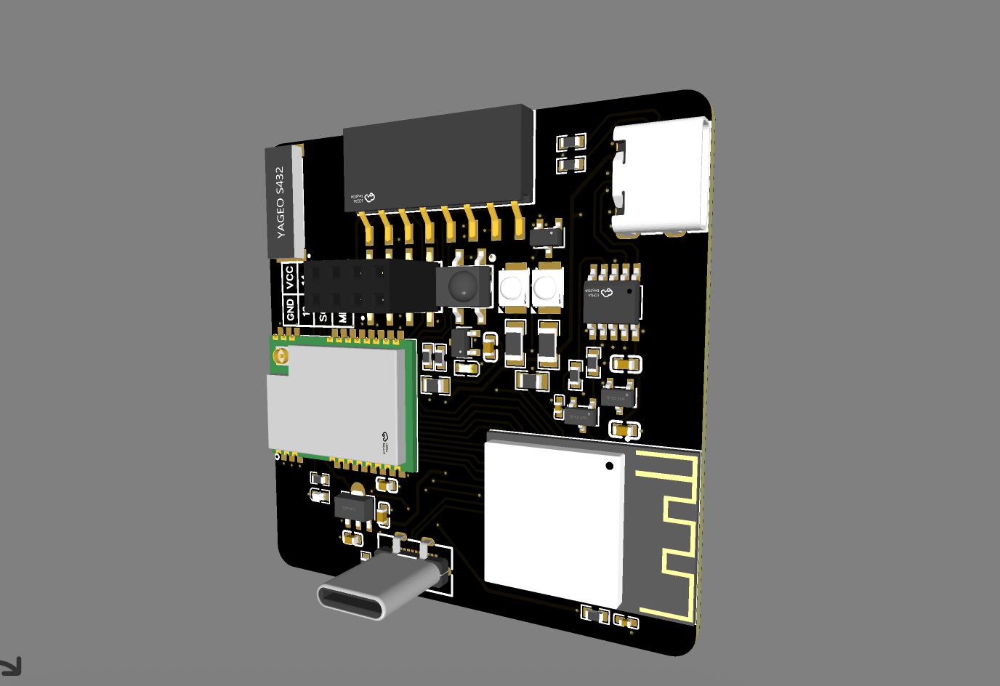

# EMWaver Air

EMWaver Air is the ESP32-S3 all-in-one EMWaver board. It combines radio, infrared, USB, and wireless support in a single device.

This private repository starts as the device home for EMWaver Air hardware material. The current thumbnail mirrors the image used by the EMWaver web build catalog.
