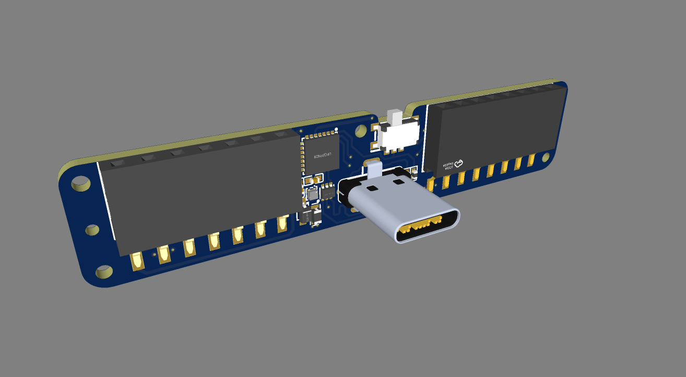

# GPIO Waver

GPIO Waver is a low-cost STM32F042 board focused on GPIO expansion and prototyping for the EMWaver hardware family.

This private repository starts as the device home for GPIO Waver hardware material. The current thumbnail mirrors the image used by the EMWaver web build catalog.
