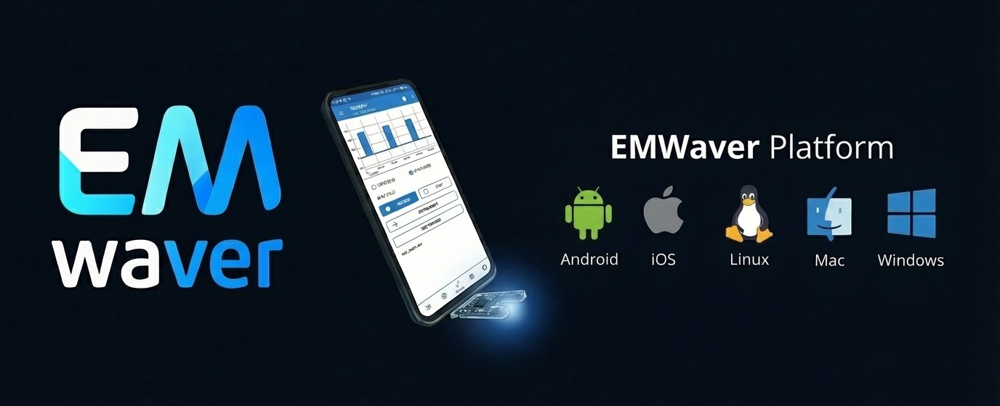

  

  

    <a href="https://luispl77.github.io/emwaver/"><strong>Docs</strong></a> ·
    <a href="https://www.youtube.com/@EMWavers"><strong>YouTube</strong></a> ·
    <a href="https://luispl77.github.io/emwaver/hardware-catalog/hardware.html"><strong>Hardware Catalog</strong></a> ·
    <a href="https://github.com/luispl77/emwaver/releases"><strong>Releases</strong></a>
  

EMWaver is an offline-first hardware hacking platform that treats your phone and PC as part of the “device”.

**Current direction:** EMWaver is now centered around a single current-gen device (**STM32 Pivot**) using **USB** as the one transport across iOS/Android/Desktop. The product is intentionally **Wavelet-first**: scripts + UI evolve without reflashing.

> Distribution is **binary-first** (apps + firmware shipped as binaries). End users should not need to build or flash from source to use EMWaver.

## Get Started

  
  
  

### Flashing Guides (if you need them)

- STM32 Pivot: `https://luispl77.github.io/emwaver/flashing-firmware/stm32/`

## Apps & Tools

- Android app: `android/`
- iOS app: `ios/`
- Desktop app: `app/`
- CLI: `cli/`
- VS Code extension: `vsc/`

## Firmware

- STM32 Pivot firmware (single firmware): `stm/emwaver-firmware/`

## Documentation

- Docs site: `https://luispl77.github.io/emwaver/`
- Technical reference hub: `https://luispl77.github.io/emwaver/documentation/`
- Hardware catalog: `https://luispl77.github.io/emwaver/hardware-catalog/`

## License

See `LICENSE` and `NOTICE`.
