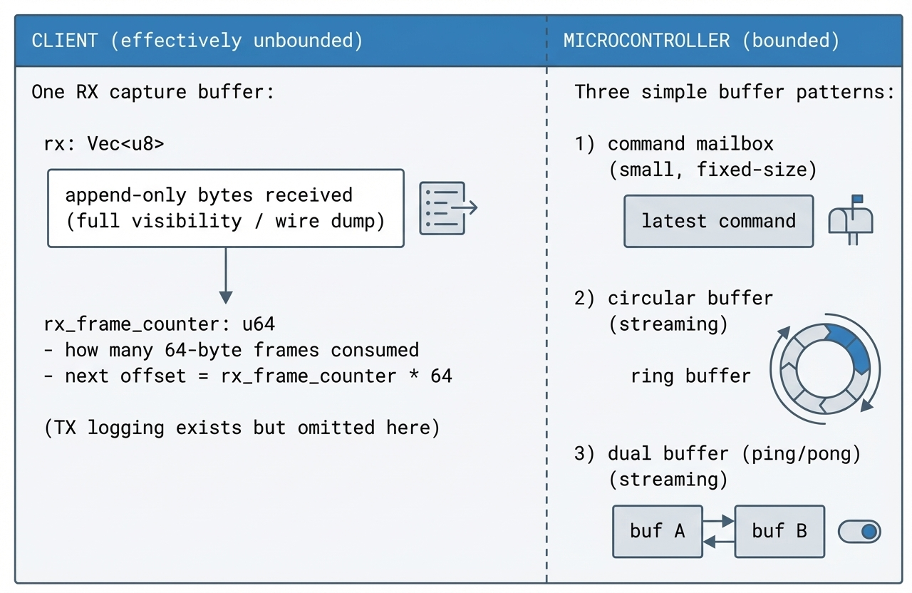

# Buffer

This page describes the **transport buffering architecture** used by EMWaver clients and devices.

## Motivation

EMWaver connects a **resource-constrained microcontroller** to a **resource-rich client**.

- On the **microcontroller** side, RAM/CPU are tight and must stay predictable.
- On the **client** side (desktop/mobile), memory and CPU are effectively “infinite” by comparison.

So the architecture is chosen around a few core ideas:

1. The client can afford to keep a single, always-available buffer for visibility and debugging.
2. The microcontroller must remain bounded, with only simple fixed-memory buffering patterns.
3. The protocol should stay simple: avoid adding “protocol layer abstractions” that hide what’s happening on the wire.

### Non-goals

What we explicitly avoid:

- **Concurrency** as a protocol feature (multiple in-flight commands, out-of-order responses).
- **Multiple endpoints/characteristics** as a design requirement to emulate richer transports.
- **Extra protocol abstraction layers** that turn a simple byte stream into a complex messaging system.

The guiding tradeoff is: **simplicity and debuggability over convenience abstractions**.

## Mental model

The goal is a simple mental model:

- The **client** keeps one main receive buffer (append-only “wire dump”) plus a simple counter to parse responses.
- The **device** (microcontroller) stays bounded: it accepts one command at a time and returns one response at a time.
- The client prioritizes **visibility** (you can inspect exactly what was sent/received) and **simplicity** (append-only receive, deterministic parsing).

## Architecture (client + microcontroller)

## Source references

### Normal commands (request → response)

The default interaction mode is intentionally boring: **one command in, one response out**.
Over USB (SysEx tunnel), the client sends commands and consumes responses as **fixed-size 64-byte frames**.

Examples (shape, not an exhaustive list):

- `gpio read --pin=4`
- `spi xfer --cs=10 --tx=0F02AABBCC --rx=4`
- `adc read --src=vrefint`

On the client side, every incoming chunk is appended to the receive buffer. The **buffer counter** is then used
to decide when a “new response frame” is available and to consume the next 64 bytes deterministically (without
mutating the underlying capture buffer).

Client implementations:

- Shared Rust buffer core (framing + capture + cursor parsing): [`crates/emwaver-buffer-core/src/buffer.rs`](https://github.com/luispl77/emwaver/blob/main/crates/emwaver-buffer-core/src/buffer.rs)
- Android bridge (Java) + implementation (Rust/JNI): [`android/app/src/main/java/com/emwaver/emwaverandroidapp/NativeBuffer.java`](https://github.com/luispl77/emwaver/blob/main/android/app/src/main/java/com/emwaver/emwaverandroidapp/NativeBuffer.java), [`crates/emwaver-buffer-android-jni/src/lib.rs`](https://github.com/luispl77/emwaver/blob/main/crates/emwaver-buffer-android-jni/src/lib.rs)
- iOS bridge (Swift) + implementation (Rust/FFI): [`ios/EMWaver/Managers/NativeBufferRust.swift`](https://github.com/luispl77/emwaver/blob/main/ios/EMWaver/Managers/NativeBufferRust.swift), [`crates/emwaver-buffer-ios-ffi/src/lib.rs`](https://github.com/luispl77/emwaver/blob/main/crates/emwaver-buffer-ios-ffi/src/lib.rs)

### Sampler record (dual buffer / ping-pong)

Sampler “record” is optimized for **bounded capture**.
The microcontroller samples at a fixed cadence (often from an ISR/timer callback), packs bits into bytes, and writes
into the current buffer until it reaches one frame (64 bytes). When full, it flips to the other buffer and marks the
full buffer as ready to transmit.

That’s what “dual buffer” buys you: **capture never stalls** while the other side is being transmitted, and memory stays
bounded (two fixed-size buffers).

Sampler examples:

- `sample start --pin=5`
- `sample stop`

Firmware implementations:

- STM32 sampler dual buffer (`bufferA`/`bufferB`): [`stm/emwaver-firmware/Core/Src/main.c`](https://github.com/luispl77/emwaver/blob/main/stm/emwaver-firmware/Core/Src/main.c)

### Retransmit (circular RX buffer)

Retransmit is the inverse direction: the client streams bytes to the device, and the device must drain them at the right pace
to reproduce a waveform (for example, IR modulation). A **circular buffer** is the simplest bounded structure for this: data can
keep arriving while a timer/ISR drains from the tail.

Retransmit examples:

- `transmit start --pin=2`
- `transmit stop`

Firmware implementations:

- STM32 retransmit switches the USB RX buffer into circular mode: [`stm/emwaver-firmware/Core/Src/main.c`](https://github.com/luispl77/emwaver/blob/main/stm/emwaver-firmware/Core/Src/main.c)
- STM32 USB circular buffer implementation: [`stm/emwaver-firmware/USB_DEVICE/App/usbd_midi_if.c`](https://github.com/luispl77/emwaver/blob/main/stm/emwaver-firmware/USB_DEVICE/App/usbd_midi_if.c)
