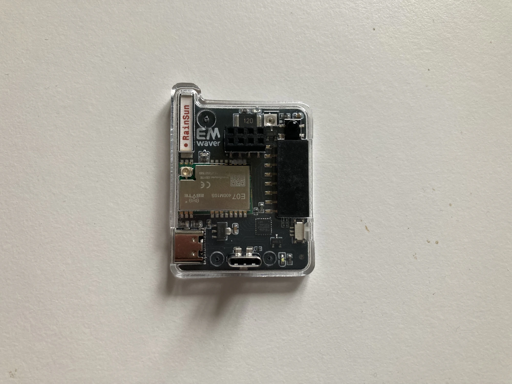

# Diagram

For the exact physical header orientation and any board-specific routing constraints, use the PCB PDF:

[PCB (PDF)](../../hardware-catalog/hardware/pcb/PCB_emwaver_2025-12-09.pdf){ .md-button }
