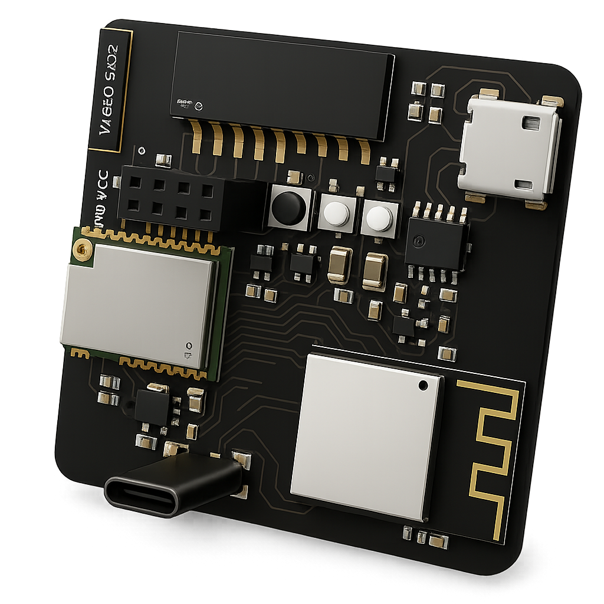

# Master **Hardware**, **Firmware**, **Software**.

  
  

    <h2>Welcome to EMWaver!</h2>
    
Your all-in-one platform for wireless experimentation, device control, and embedded development.

    

      Explore the tabs above to learn more, review the firmware update process, or visit the store.
    

  

EMWaver combines an ESP32-S3 platform with mobile and cloud tooling for wireless experimentation, signal analysis, and remote control. The ecosystem centers on Wavelets—portable JavaScript bundles that present UI through the EMWaver DSL and orchestrate hardware features without custom firmware builds.

-   :material-chip:{ .lg .middle } **Hardware**

    ---

    ESP32-S3 board components and specifications

    [:octicons-arrow-right-24: Go to Hardware](hardware.md)

-   :material-cog:{ .lg .middle } **Firmware**

    ---

    ESP-IDF firmware architecture and modules

    [:octicons-arrow-right-24: Go to Firmware](#firmware)

-   :material-script-text-outline:{ .lg .middle } **Wavelets**

    ---

    High-level scripting and UI bundles for EMWaver

    [:octicons-arrow-right-24: Learn about Wavelets](wavelets.md)

-   :material-xml:{ .lg .middle } **EMWaver DSL**

    ---

    Declarative UI language powering the runtime

    [:octicons-arrow-right-24: Explore the DSL](emwaver-dsl.md)

## What is EMWaver?

EMWaver is designed for enthusiasts, makers, and researchers who want to:
- Experiment with sub-GHz and infrared signals
- Build and share custom workflows through Wavelets
- Manage firmware safely without recompiling for every use case
- Expand with GPIO accessories and automation scripts

## Application Overview

The mobile application is structured around five primary fragments, each focused on a key workflow:

1. **Home** – Manage connections to the EMWaver device, view device health, and access quick actions for recent wavelets or captures.
2. **ISM** – Inspect and configure sub-GHz radio settings, including modulation parameters, channel presets, and regulatory constraints.
3. **Sampler** – Capture and analyze RF and IR signals, leverage IRP decoding, visualize waveforms, and prepare recordings for replay or wavelet integration.
4. **Wavelets** – Edit, organize, and sync JavaScript bundles that render UI via the EMWaver DSL. Import IRDB remote profiles to generate control surfaces and trigger the correct IR payloads.
5. **Agents** – Chat with the EMWaver LLM assistant for troubleshooting, documentation lookups, and live wavelet debugging. The agent can review console output, propose fixes, and help author new scripts.

For guidance on authoring scripts, see the [Wavelets](wavelets.md) and [EMWaver DSL](emwaver-dsl.md) pages.

## Project Structure

- **Hardware:** ESP32-S3 board with CC1101, IR transceiver, USB-C, and GPIO expansion
- **Firmware:** ESP-IDF-based, exposes BLE APIs consumed by the mobile runtime
- **Wavelets & DSL:** JavaScript runtime and declarative UI layer shared across platforms
- **Documentation:** MkDocs site collecting guides for hardware, firmware, and runtime features

---

## Hardware

The EMWaver board combines the ESP32-S3 with sub-GHz (CC1101) and infrared peripherals, USB-C for power and flashing, and general-purpose I/O. Expansion headers support custom add-ons for experimentation and automation projects. See the [Hardware](hardware.md) page for a complete component breakdown.

---

## Firmware

Firmware lives in `main/` and is built with ESP-IDF. Core modules include BLE communication (`ble_server.c`), sub-GHz drivers (`cc1101.c`), RFID support (`mfrc522.c`), IR transceivers, and optional BadUSB features. The firmware exposes consistent APIs so Wavelets can orchestrate hardware behavior through higher-level abstractions.

---

## Documentation

This site consolidates quickstarts, tooling references, and runtime guides. Explore the dedicated pages for firmware builds, Wavelets authoring, and the EMWaver DSL to dive deeper into each layer of the platform.

