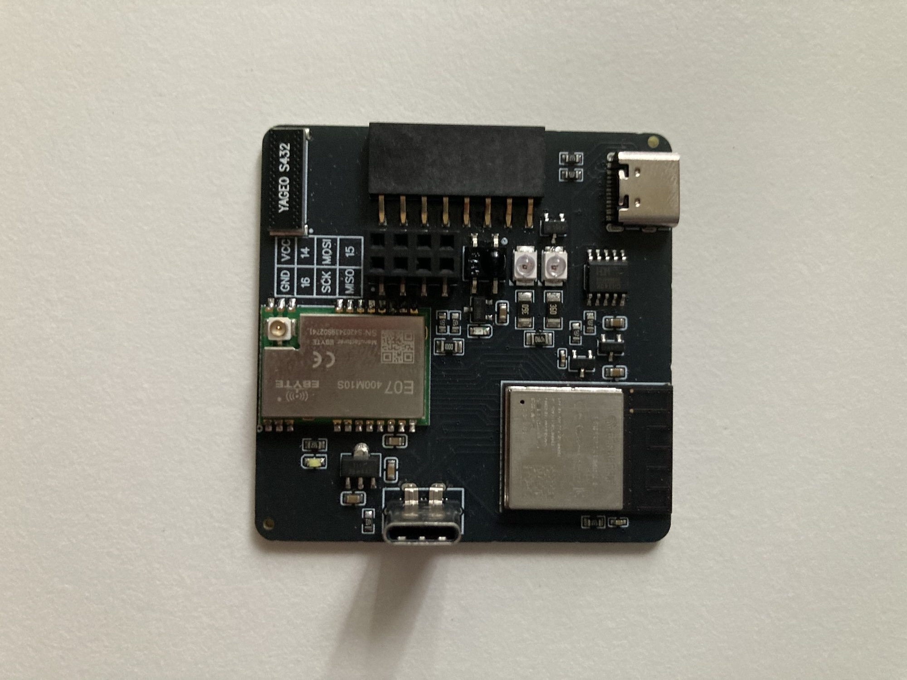

# EMWaver Air

EMWaver Air is the ESP32-S3 all-in-one EMWaver board. It combines an
ESP32-S3-MINI-1-N8 module, CC1101-class 433 MHz radio, IR receive/transmit,
USB-C, BLE/Wi-Fi capability, an 8-pin GPIO add-on header, and a 2x4 radio-style
expansion header on one board.

## Build Assets

| File | Purpose |
| --- | --- |
| [Schematic_EMWAVER_AIR_2026-03-26.pdf](Schematic_EMWAVER_AIR_2026-03-26.pdf) | schematic review and net reference |
| [PCB_PCB_EMWAVER_AIR_2026-03-26.pdf](PCB_PCB_EMWAVER_AIR_2026-03-26.pdf) | board layout export |
| [Gerber_EMWAVER_AIR_PCB_EMWAVER_AIR_2026-03-26.zip](Gerber_EMWAVER_AIR_PCB_EMWAVER_AIR_2026-03-26.zip) | PCB fabrication upload |
| [BOM_EMWAVER_AIR_2026-03-26.csv](BOM_EMWAVER_AIR_2026-03-26.csv) | assembly BOM |
| [PickAndPlace_PCB_EMWAVER_AIR_2026-03-26.csv](PickAndPlace_PCB_EMWAVER_AIR_2026-03-26.csv) | CPL / pick-and-place |
| [EMWAVER_AIR_CASE.stl](EMWAVER_AIR_CASE.stl) | printable case |
| [catalog/device.json](catalog/device.json) | catalog metadata and source links |

Catalog estimate: 2 units for about 60 USD. Treat this as a rough historical
estimate, not a guaranteed current quote.

## Major Components

| Area | Part / note |
| --- | --- |
| MCU | ESP32-S3-MINI-1-N8 |
| USB bridge / programming | CH340K plus USB-C |
| Radio | EBYTE E07-400M10S / CC1101-class module |
| Antenna | 433 MHz chip antenna |
| IR receiver | Everlight IRM-H638T/TR2 |
| IR transmit | two SE03-LP2835S-1460 IR LEDs with AO3400A driver |
| Power | USB 5 V input, AMS1117-3.3 3.3 V regulator |
| Expansion | 8-pin GPIO header and 2x4 header |

## Pinout And Signals

The schematic names the following board-level signals. Connector pin orientation
still needs an annotated board image before treating this as production assembly
documentation.

| Signal | Function |
| --- | --- |
| `D+`, `D-` | native USB data path |
| `U0TXD`, `U0RXD` | serial programming path through CH340K |
| `DTR`, `RTS`, `EN`, `GPIO0` | ESP32-S3 auto-program/reset control |
| `IR_TX` | IR LED driver control |
| `MOSI`, `MISO`, `SCK`, `NSS` | SPI bus for radio/add-on devices |
| `GDO0`, `GDO2` | CC1101-style interrupt/status lines |
| `GPIO14`, `GPIO15` | exposed GPIO / radio-adjacent signals shown in schematic |
| `VCC`, `+5V`, `GND` | 3.3 V logic rail, USB 5 V rail, ground |

ESP32 firmware defaults currently use SPI `MOSI=GPIO11`, `SCK=GPIO12`,
`MISO=GPIO13`; IR transmit defaults include `GPIO4` and shield-compatible
`GPIO37`. Verify Air-specific routing against the schematic before changing
firmware pin defaults.

## Manufacturing With JLCPCB

1. Upload `Gerber_EMWAVER_AIR_PCB_EMWAVER_AIR_2026-03-26.zip`.
2. Enable assembly if ordering assembled boards.
3. Upload `BOM_EMWAVER_AIR_2026-03-26.csv` and
   `PickAndPlace_PCB_EMWAVER_AIR_2026-03-26.csv`.
4. Review USB-C connectors, ESP32-S3 module orientation, E07 radio module,
   antenna part, IR LED polarity, and any out-of-stock substitutions.
5. Keep the antenna area clear of copper, screws, and case material changes
   unless the RF layout is intentionally revised.

## Bring-Up Checklist

1. Inspect USB-C connectors, ESP32-S3 module, radio module, antenna, and IR LED
   polarity.
2. Power from USB and verify 5 V and 3.3 V rails before connecting to the app.
3. Confirm the serial/programming path enumerates if internal flashing is
   needed.
4. Use the EMWaver app-managed setup/update flow for normal device use.
5. Test USB protocol, IR transmit/receive, radio receive, radio transmit, and
   exposed GPIO in that order.

## Firmware Development

Normal users should not build firmware manually. Internal ESP32-S3 development
lives in [`../../esp`](../../esp); that workspace targets ESP-IDF v5.5.1 and
documents build/flash commands.
