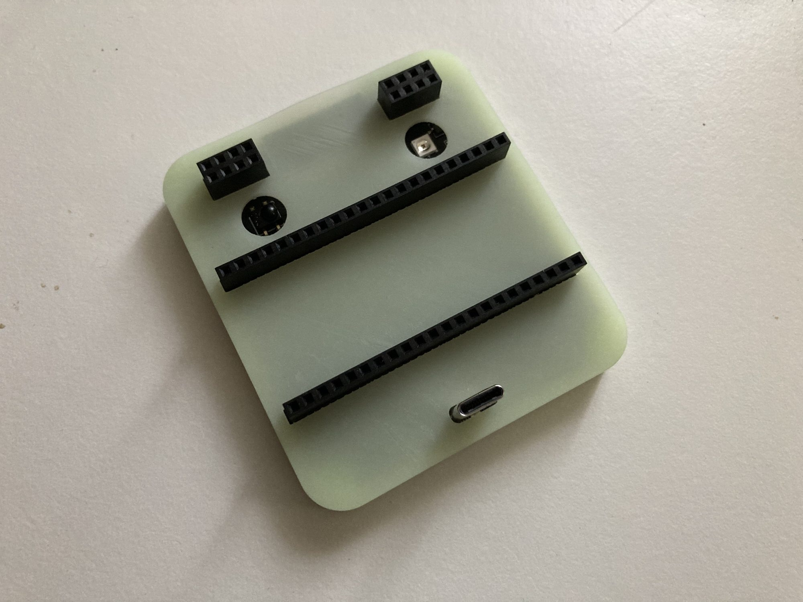

# EMWaver Carrier

EMWaver Carrier is the bring-your-own-MCU ESP32-S3 carrier board. It provides
USB-C, IR receive/transmit, CC1101 module support, and expansion headers around
an ESP32-S3 DevKit-class module.

## Build Assets

| File | Purpose |
| --- | --- |
| [Schematic_EMWAVER_CARRIER_2026-03-26.pdf](Schematic_EMWAVER_CARRIER_2026-03-26.pdf) | schematic review and net reference |
| [PCB_PCB_EMWAVER_CARRIER_2026-03-26.pdf](PCB_PCB_EMWAVER_CARRIER_2026-03-26.pdf) | board layout export |
| [Gerber_EMWAVER_CARRIER_PCB_EMWAVER_CARRIER_2026-03-26.zip](Gerber_EMWAVER_CARRIER_PCB_EMWAVER_CARRIER_2026-03-26.zip) | PCB fabrication upload |
| [BOM_EMWAVER_CARRIER_2026-03-26.csv](BOM_EMWAVER_CARRIER_2026-03-26.csv) | assembly BOM |
| [PickAndPlace_PCB_EMWAVER_CARRIER_2026-03-26.csv](PickAndPlace_PCB_EMWAVER_CARRIER_2026-03-26.csv) | CPL / pick-and-place |
| [EMWAVER_CARRIER_CASE.stl](EMWAVER_CARRIER_CASE.stl) | printable case |
| [catalog/device.json](catalog/device.json) | catalog metadata and source links |

Catalog estimate: 2 units for about 38 USD.

## Required External Parts

- ESP32-S3 DevKit-class module.
- CC1101 module compatible with the board header.
- USB-C cable.

## Major Components

| Area | Part / note |
| --- | --- |
| MCU | user-supplied ESP32-S3 DevKit |
| Radio | user-supplied CC1101 module |
| IR receiver | Everlight IRM-H638T/TR2 |
| IR transmit | NTD3535I16 IR LED with AO3400A driver |
| Expansion | two 22-pin DevKit headers, one 8-pin add-on header, two 2x4 module headers |
| Power | USB 5 V input and 3.3 V logic rail from the DevKit/carrier design |

## Pinout And Signals

The schematic exposes these named nets. Verify physical orientation against the
PCB PDF before wiring modules.

| Signal | Function |
| --- | --- |
| `D+`, `D-` | USB data path |
| `IR_RX` | IR receiver output |
| `IR_TX` | IR LED driver input |
| `MOSI`, `MISO`, `SCK`, `NSS` | SPI bus to CC1101/add-on modules |
| `GDO0`, `GDO2` | CC1101 interrupt/status lines |
| `GPIO14`, `GPIO15` | exposed ESP32-S3 GPIO signals shown in schematic |
| `+5V`, `VCC`, `GND` | USB 5 V, 3.3 V logic, ground |

The current ESP32 firmware defaults are `MOSI=GPIO11`, `SCK=GPIO12`,
`MISO=GPIO13`, default IR transmit on `GPIO4`, and shield-compatible IR
transmit on `GPIO37`. Align the installed DevKit and jumper/header routing with
those defaults or update firmware configuration intentionally.

## Manufacturing With JLCPCB

1. Upload `Gerber_EMWAVER_CARRIER_PCB_EMWAVER_CARRIER_2026-03-26.zip`.
2. Upload the matching BOM and CPL if ordering assembly.
3. Check DevKit socket/header placement, CC1101 header orientation, USB-C
   connector direction, and IR component polarity.
4. Do not substitute the CC1101 module footprint without checking RF and header
   compatibility.

## Assembly And Bring-Up

1. Assemble low-profile passives first, then USB/IR components, then headers.
2. Seat the ESP32-S3 DevKit only after checking for shorts on 5 V and 3.3 V.
3. Install the CC1101 module in the documented orientation.
4. Power over USB and confirm the DevKit enumerates.
5. Use the EMWaver app-managed setup/update flow for normal use.
6. Test USB, IR RX/TX, SPI module access, and GPIO expansion.

## Firmware Development

Normal users should not build firmware manually. Internal ESP32-S3 development
lives in [`../../esp`](../../esp).
