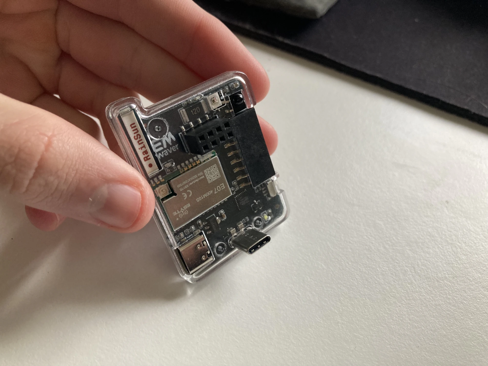

# EMWaver Link

EMWaver Link is the STM32F042G6U6 EMWaver board with built-in 433 MHz
CC1101-class radio support. It is the integrated USB radio board in the current
EMWaver family: native USB, IR receive/transmit, 433 MHz radio, antenna, case,
and app-managed local control.

## Visual Identification

Photos show a compact black board inside a clear case. The visible top
side includes an E07 radio module, a Rainsun 433 MHz antenna, a 2x4 module
header, status LEDs, IR parts, USB-C, and a small board-to-phone USB-C plug.
Workflow photos show the board connected directly to a phone and running the
EMWaver shell over USB.

Images:

- [clear-case top-side photo](catalog/images/IMG_0149.webp)
- [phone USB shell workflow](catalog/images/IMG_0184.webp)
- [gallery detail photo](catalog/images/IMG_0153.webp)
- [render](catalog/images/emwaver-link.png)

## Build Files

| File | Purpose |
| --- | --- |
| [Schematic_EMWAVER_LINK_2026-03-26.pdf](Schematic_EMWAVER_LINK_2026-03-26.pdf) | schematic review and net reference |
| [PCB_PCB_EMWAVER_LINK_2026-03-26.pdf](PCB_PCB_EMWAVER_LINK_2026-03-26.pdf) | board layout export |
| [Gerber_EMWAVER_LINK_PCB_EMWAVER_LINK_2026-03-26.zip](Gerber_EMWAVER_LINK_PCB_EMWAVER_LINK_2026-03-26.zip) | PCB fabrication upload |
| [BOM_EMWAVER_LINK_2026-03-26.csv](BOM_EMWAVER_LINK_2026-03-26.csv) | assembly BOM |
| [PickAndPlace_PCB_EMWAVER_LINK_2026-03-26.csv](PickAndPlace_PCB_EMWAVER_LINK_2026-03-26.csv) | assembly placement file |
| [EMWAVER_LINK_CASE.stl](EMWAVER_LINK_CASE.stl) | printable case |

## Major Components

| Area | Part / note |
| --- | --- |
| MCU | STM32F042G6U6, 48 MHz, native USB |
| Radio | EBYTE E07-400M10S / CC1101-class 433 MHz module |
| Antenna | AN1603-433 |
| IR receiver | Everlight IRM-H638T/TR2 |
| IR transmit | NTD3535I16 IR LED with AO3400A driver |
| USB | USB-C |
| Power | USB 5 V input, AMS1117-3.3 regulator |
| Boot | onboard boot/DFU switch |

## Pinout And Signals

The current schematic maps the integrated functions to these MCU pins and nets:

| MCU pin / net | Function |
| --- | --- |
| `PB8-BOOT0` | boot mode / DFU entry path |
| `PA0` / `IR_RX` | IR receiver input |
| `PA1` / `IR_TX` | IR LED driver output |
| `PA2` / `GDO0` | CC1101 digital output / interrupt |
| `PA3` / `GDO2` | CC1101 digital output / interrupt |
| `PA4` / `NSS` | SPI chip select |
| `PA5` / `SCK` | SPI clock |
| `PA6` / `MISO` | SPI MISO |
| `PA7` / `MOSI` | SPI MOSI |
| `PA9[PA11]` | USB `D-` net in schematic export |
| `PA10[PA12]` | USB `D+` net in schematic export |
| `PA13`, `PA14` | SWD data/clock capable pins |
| `PB6`, `PB7` | exposed STM32 GPIO/UART/I2C-capable pins where routed |
| `VCC`, `VBUS`, `GND` | 3.3 V logic, USB 5 V, ground |

Firmware note: the shared STM32 firmware config uses USB on `PA11`/`PA12`, SPI1
on `PA4`-`PA7`, UART/I2C on `PB6`/`PB7`, and PWM support on TIM2 channels
`PA0`-`PA3`. Link's integrated IR/radio routing consumes several of those pins,
so external add-on use must account for those conflicts.

## Manufacturing With JLCPCB

1. Upload `Gerber_EMWAVER_LINK_PCB_EMWAVER_LINK_2026-03-26.zip`.
2. Enable assembly if ordering assembled boards.
3. Upload `BOM_EMWAVER_LINK_2026-03-26.csv` and
   `PickAndPlace_PCB_EMWAVER_LINK_2026-03-26.csv`.
4. Review STM32 orientation, E07 radio module orientation, antenna placement,
   USB-C connector, IR LED polarity, IR receiver orientation, boot switch, and
   regulator.
5. Avoid substituting the radio module, antenna, or matching-related RF parts
   unless RF behavior will be retested.

## Assembly Notes

- Solder low-profile passives first if hand-assembling.
- Keep the antenna area clear of metal fasteners and case changes.
- Verify IR LED polarity before power-on.
- Confirm USB-C connector seating mechanically before enclosure fit.

## Bring-Up Checklist

1. Inspect the STM32, USB-C, regulator, radio module, antenna, and IR components.
2. Check for shorts between `VBUS`, `VCC`, and `GND`.
3. Power from USB and verify the 3.3 V rail.
4. Confirm USB enumeration in the EMWaver app.
5. Test firmware version/board-info commands.
6. Test IR receive, then IR transmit.
7. Read radio registers over SPI before transmitting.
8. Test receive-only at 433 MHz, then low-duty transmit.
9. Validate final range and thermal behavior inside the case.

## Firmware

Normal users should not build or flash firmware manually. EMWaver apps should
handle setup and updates for supported firmware builds.
