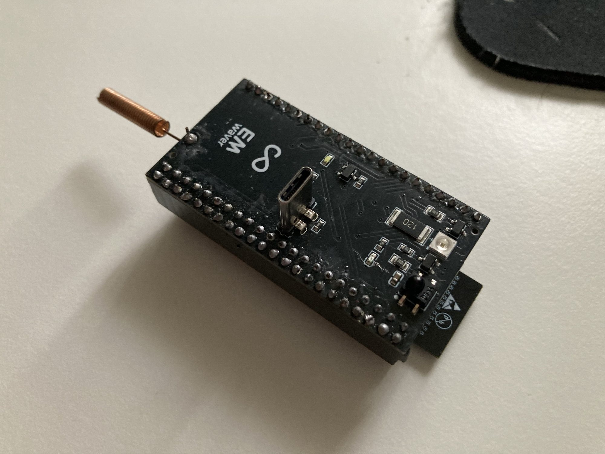

# EMWaver Shield

EMWaver Shield is a shield-style ESP32-S3 carrier in the EMWaver hardware
family. It adds IR receive/transmit, USB-C, an RFM69HW 433 MHz radio footprint,
a helical antenna, and a large duplicated 44-pin shield header for prototyping.

EMWaver apps remain the normal software path. This repo documents hardware
reproduction and bring-up; it is not the source of truth for app, backend,
provisioning, or private firmware release workflows.

## Visual Identification

Catalog photos show a long black shield with two dense through-hole header rows,
a vertical USB-C connector, front-side IR parts, a 120-marked component near the
IR section, a copper helical antenna at one end, and an RFM69HW module on the
back side. Phone photos show the shield attached along the lower edge of a phone
for app-driven control.

Representative catalog images:

- [front-side shield photo](catalog/images/IMG_0067.jpg)
- [back-side radio module photo](catalog/images/IMG_0096.jpg)
- [phone workflow photo](catalog/images/emwaver-shield-phone.jpg)
- [catalog render](catalog/images/EMWAVER_SHIELD.png)

## Build Assets

| File | Purpose |
| --- | --- |
| [Schematic_EMWAVER_SHIELD_2026-03-26.pdf](Schematic_EMWAVER_SHIELD_2026-03-26.pdf) | schematic review and net reference |
| [PCB_PCB_EMWAVER_SHIELD_2026-03-26.pdf](PCB_PCB_EMWAVER_SHIELD_2026-03-26.pdf) | board layout export |
| [BOM_EMWAVER_SHIELD_2026-03-26.csv](BOM_EMWAVER_SHIELD_2026-03-26.csv) | assembly BOM |
| [PickAndPlace_PCB_EMWAVER_SHIELD_2026-03-26.csv](PickAndPlace_PCB_EMWAVER_SHIELD_2026-03-26.csv) | CPL / pick-and-place |
| [catalog/device.json](catalog/device.json) | catalog metadata and source links |

The catalog metadata references `Gerber_EMWAVER_SHIELD_PCB_EMWAVER_SHIELD_2026-03-26.zip`,
but that Gerber ZIP is not currently committed in this folder. Export from the
EasyEDA project or add the missing ZIP before treating this as a complete
self-contained manufacturing package.

Catalog estimate: 5 units for about 32 USD.

## Required External Parts

- ESP32-S3 DevKit-class module.
- RFM69HW-433S2R module.
- 433 MHz helical antenna.
- USB-C cable.

## Major Components

| Area | Part / note |
| --- | --- |
| MCU | user-supplied ESP32-S3 DevKit |
| Radio | RFM69HW-433S2R |
| Antenna | VG433SNX39-6W3 helical antenna |
| IR receiver | Everlight IRM-H638T/TR2 |
| IR transmit | NTD3535I16 IR LED with AO3400A driver |
| Expansion | 44-pin shield header plus 22-pin duplicated GPIO header |
| USB | vertical USB-C connector |

## Pinout And Signals

The schematic identifies the following named nets. The 44-pin header pin order
must be confirmed against the PCB PDF or an annotated board image before making
daughterboards.

| Signal | Function |
| --- | --- |
| `D+`, `D-` | USB data path |
| `IR_RX` | IR receiver output |
| `IR_TX` | IR LED driver input |
| RFM69 SPI nets | SPI bus between ESP32-S3 and RFM69HW module |
| RFM69 IRQ/control nets | radio interrupt/control lines routed through the shield |
| `+5V`, `VCC`, `GND` | USB 5 V, 3.3 V logic, ground |

Current ESP32-S3 shield signal map:

| Shield signal | ESP32-S3 GPIO | Notes |
| --- | --- | --- |
| RFM69 `NSS` / CS | `GPIO36` | RFM69HW chip select |
| RFM69 `MOSI` | `GPIO11` | SPI data bus |
| RFM69 `SCK` | `GPIO12` | SPI data bus |
| RFM69 `MISO` | `GPIO13` | SPI data bus |
| RFM69 `DIO0` | `GPIO1` | RFM69 IRQ/control |
| RFM69 `DIO1` | `GPIO2` | RFM69 IRQ/control |
| RFM69 `DIO2` | `GPIO42` | RFM69 IRQ/control |
| RFM69 `DIO3` | `GPIO41` | RFM69 IRQ/control |
| RFM69 `DIO4` | `GPIO40` | RFM69 IRQ/control |
| RFM69 `DIO5` | `GPIO39` | RFM69 IRQ/control |
| `IR_TX` | `GPIO37` | IR LED driver input |
| `IR_RX` | `GPIO38` | IR receiver output |
| default IR transmit | `GPIO4` | firmware fallback / non-shield default |
| IR LED guard | `GPIO5` | firmware guard output |

Generic SPI examples may use `GPIO10` as a default chip select, but the
RFM69HW on this shield uses `GPIO36` for `NSS` / CS.

## Manufacturing With JLCPCB

1. Export or add the missing Gerber ZIP from the EasyEDA project referenced in
   `catalog/device.json`.
2. Upload the Gerber ZIP.
3. Upload `BOM_EMWAVER_SHIELD_2026-03-26.csv` and
   `PickAndPlace_PCB_EMWAVER_SHIELD_2026-03-26.csv` if ordering assembly.
4. Review RFM69HW orientation, antenna placement, 44-pin shield header
   orientation, ESP32-S3 DevKit header alignment, USB-C connector direction, IR
   LED polarity, and IR receiver orientation.
5. Keep antenna clearance and enclosure materials consistent with RF testing.

## Assembly Flow

1. Solder low-profile passives first.
2. Add USB-C and IR components.
3. Add the RFM69HW module and helical antenna if building the radio variant.
4. Add the 44-pin shield header and ESP32-S3 DevKit headers.
5. Seat the ESP32-S3 DevKit last, after checking rails for shorts.

## Bring-Up Checklist

1. Verify `+5V`, `VCC`, and `GND` before inserting the ESP32-S3 DevKit.
2. Confirm the ESP32-S3 DevKit powers and enumerates.
3. Use the EMWaver app-managed setup/update flow for normal use.
4. Test IR receive and transmit.
5. Verify RFM69 register access over SPI before transmitting.
6. Test receive-only at 433 MHz, then low-duty transmit.
7. Validate shield-header signals needed by your daughterboard.

## Firmware Development

Normal users should not build firmware manually. Internal ESP32-S3 development
lives in [`../../esp`](../../esp).

## Source References

- EasyEDA project: `https://easyeda.com/editor#project_id=a9ecc255b85443dd9903fbab629f9e0b`
- Mirrored catalog images live in `catalog/images/`.
- Additional design references live under [`docs/`](docs/).

## Documentation Gaps To Close

- Commit the missing Gerber ZIP referenced by catalog metadata.
- Add a confirmed 44-pin header pin table with physical orientation.
- Add an annotated board image.
- Add shield-specific ESP32-S3 DevKit compatibility notes.
