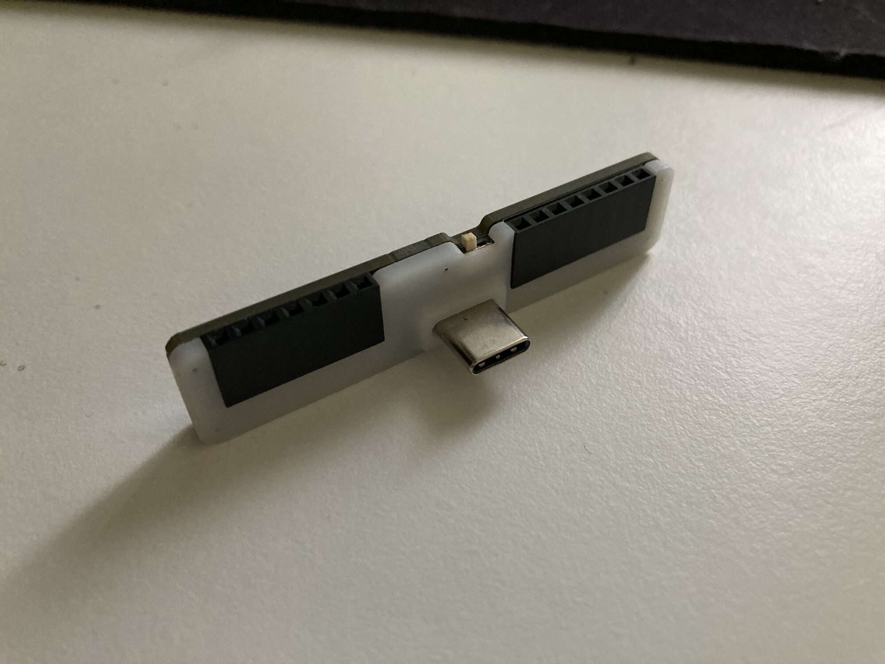

# GPIO Waver

GPIO Waver is a low-cost STM32F042G6U6 USB board focused on GPIO expansion and
prototyping. It is also the base board for add-ons such as RFID Waver.

## Build Assets

| File | Purpose |
| --- | --- |
| [Schematic_GPIO_WAVER_2026-03-26.pdf](Schematic_GPIO_WAVER_2026-03-26.pdf) | schematic review and net reference |
| [PCB_PCB_GPIO_WAVER_2026-03-26.pdf](PCB_PCB_GPIO_WAVER_2026-03-26.pdf) | board layout export |
| [Gerber_GPIO_WAVER_PCB_GPIO_WAVER_2026-03-26.zip](Gerber_GPIO_WAVER_PCB_GPIO_WAVER_2026-03-26.zip) | PCB fabrication upload |
| [BOM_GPIO_WAVER_2026-03-26.csv](BOM_GPIO_WAVER_2026-03-26.csv) | assembly BOM |
| [PickAndPlace_PCB_GPIO_WAVER_2026-03-26.csv](PickAndPlace_PCB_GPIO_WAVER_2026-03-26.csv) | CPL / pick-and-place |
| [GPIO_WAVER_CASE.stl](GPIO_WAVER_CASE.stl) | printable case |
| [catalog/device.json](catalog/device.json) | catalog metadata |

Catalog estimate: 5 units for about 48 USD.

## Major Components

| Area | Part / note |
| --- | --- |
| MCU | STM32F042G6U6, 48 MHz, native USB |
| USB | USB-C with ESD protection and resettable fuse |
| Power | NCP114AMX330TBG 3.3 V regulator |
| Headers | 7-pin and 8-pin GPIO/module headers |
| Boot | onboard boot switch |

## Pinout And Firmware Signals

The schematic and STM32 firmware expose these signals. Physical pin order on
`U2` and `U4` should be verified against the PCB PDF before making a cable.

| MCU pin / net | Firmware role |
| --- | --- |
| `PA0` | GPIO, ADC0, TIM2 PWM CH1 |
| `PA1` | GPIO, ADC1, TIM2 PWM CH2 |
| `PA2` | GPIO, ADC2, TIM2 PWM CH3 |
| `PA3` | GPIO, ADC3, TIM2 PWM CH4 |
| `PA4` / `SPI1_NSS` | SPI chip select |
| `PA5` / `SPI1_SCK` | SPI clock |
| `PA6` / `SPI1_MISO` | SPI MISO |
| `PA7` / `SPI1_MOSI` | SPI MOSI |
| `PA11` | USB `D-` |
| `PA12` | USB `D+` |
| `PA13` / `SYS_SWDIO` | SWD data |
| `PA14` / `SYS_SWCLK` | SWD clock |
| `PB6` / `USART1_TX` | GPIO, UART TX, I2C SCL |
| `PB7` / `USART1_RX` | GPIO, UART RX, I2C SDA |
| `BOOT0` | boot mode / DFU entry |
| `VCC`, `VBUS`, `GND` | 3.3 V logic, USB 5 V, ground |

Header footprints in the BOM:

| Designator | Footprint | Intended use |
| --- | --- | --- |
| `U2` | 1x8 2.54 mm header | GPIO/SPI/add-on header |
| `U4` | 1x7 2.54 mm header | GPIO/power/boot-style header |

## Manufacturing With JLCPCB

1. Upload `Gerber_GPIO_WAVER_PCB_GPIO_WAVER_2026-03-26.zip`.
2. Upload `BOM_GPIO_WAVER_2026-03-26.csv` and
   `PickAndPlace_PCB_GPIO_WAVER_2026-03-26.csv` for assembly.
3. Review USB-C connector, STM32 orientation, regulator, ESD diode, resettable
   fuse, boot switch, and header orientation.

## Bring-Up Checklist

1. Check continuity on `VBUS`, `VCC`, and `GND`.
2. Power over USB and verify 3.3 V.
3. Confirm USB enumeration.
4. Use the EMWaver app-managed firmware/update path.
5. Test GPIO read/write, ADC on `PA0`-`PA7`, PWM on `PA0`-`PA3`, SPI, UART, and
   I2C as needed.

## Firmware Development

Internal STM32 development lives in [`../../stm`](../../stm). Normal users
should use app-managed firmware and should not need STM32CubeIDE.
