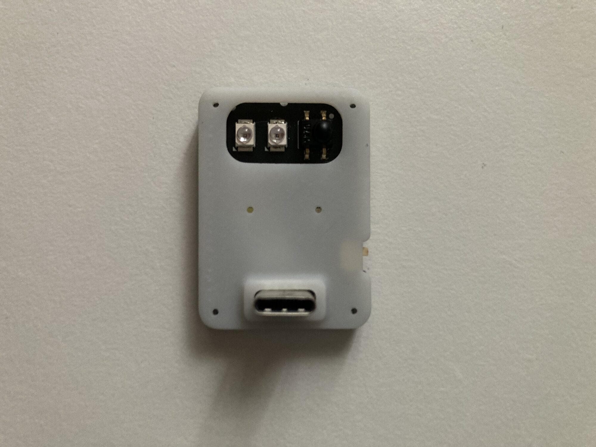

# Infrared Waver

Infrared Waver is a low-cost STM32F042G6U6 USB board for infrared capture and
replay. It includes an IR receiver, high-current IR LED driver, USB-C, and the
same app-managed EMWaver firmware path as the other STM32 boards.

## Build Assets

| File | Purpose |
| --- | --- |
| [Schematic_INFRARED_WAVER_2026-03-26.pdf](Schematic_INFRARED_WAVER_2026-03-26.pdf) | schematic review and net reference |
| [PCB_PCB_INFRARED_WAVER_2026-03-26.pdf](PCB_PCB_INFRARED_WAVER_2026-03-26.pdf) | board layout export |
| [Gerber_INFRARED_WAVER_PCB_INFRARED_WAVER_2026-03-26.zip](Gerber_INFRARED_WAVER_PCB_INFRARED_WAVER_2026-03-26.zip) | PCB fabrication upload |
| [BOM_INFRARED_WAVER_2026-03-26.csv](BOM_INFRARED_WAVER_2026-03-26.csv) | assembly BOM |
| [PickAndPlace_PCB_INFRARED_WAVER_2026-03-26.csv](PickAndPlace_PCB_INFRARED_WAVER_2026-03-26.csv) | CPL / pick-and-place |
| [INFRARED_WAVER_CASE.stl](INFRARED_WAVER_CASE.stl) | printable case |
| [catalog/device.json](catalog/device.json) | catalog metadata |

Catalog estimate: 5 units for about 36 USD.

## Major Components

| Area | Part / note |
| --- | --- |
| MCU | STM32F042G6U6, 48 MHz, native USB |
| IR receiver | Everlight IRM-H638T/TR2 |
| IR transmit | NTD3535I16 IR LED with AO3400A driver |
| USB | USB-C |
| Power | NCP114AMX330TBG 3.3 V regulator |
| Boot | onboard DFU switch |

## Pinout And Signals

| MCU pin / net | Function |
| --- | --- |
| `PA1` / `IR_RX` | IR receiver input |
| `PA2` / `IR_TX` | IR LED driver output, TIM2 PWM CH3 |
| `PA11` | USB `D-` |
| `PA12` | USB `D+` |
| `BOOT0` | DFU boot switch |
| `VCC`, `VBUS`, `GND` | 3.3 V logic, USB 5 V, ground |

The shared STM32 firmware can also expose GPIO/ADC/PWM behavior on available
STM32 pins if the board routes them, but this board should be treated primarily
as a purpose-built IR device.

## Manufacturing With JLCPCB

1. Upload `Gerber_INFRARED_WAVER_PCB_INFRARED_WAVER_2026-03-26.zip`.
2. Upload `BOM_INFRARED_WAVER_2026-03-26.csv` and
   `PickAndPlace_PCB_INFRARED_WAVER_2026-03-26.csv` for assembly.
3. Review IR LED polarity/orientation, IR receiver orientation, USB-C connector,
   STM32 orientation, regulator, and DFU switch.

## Bring-Up Checklist

1. Verify there are no shorts between `VBUS`, `VCC`, and `GND`.
2. Power over USB and verify 3.3 V.
3. Confirm USB enumeration.
4. Use the EMWaver app-managed firmware/update path.
5. Test IR receive with a known remote.
6. Test IR transmit at low duty first, then validate range and thermal behavior.

## Firmware Development

Internal STM32 development lives in [`../../stm`](../../stm). Normal users
should not need STM32CubeIDE or manual flashing.
