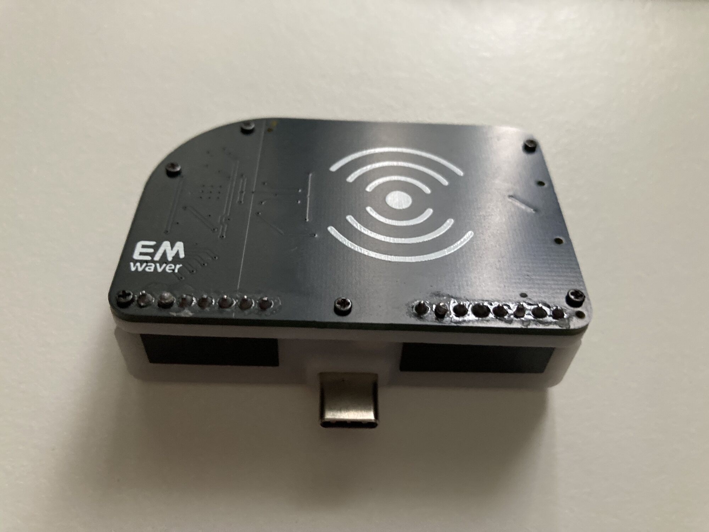

# RFID Waver

RFID Waver is an MFRC522-based 13.56 MHz RFID add-on module intended to pair
with GPIO Waver. Together they provide RFID read/write workflows through the
EMWaver app where supported by the tag/card type.

## Visual Identification

Catalog photos show a square black RFID add-on with a printed contactless-symbol
antenna area, a USB-C-facing dock position when paired with GPIO Waver, and
through-hole header rows along the edges. Phone workflow photos show the RFID UI
open with read/write block controls while the board is docked below the phone.

Representative catalog images:

- [RFID antenna board photo](catalog/images/IMG_0062.jpg)
- [phone RFID workflow](catalog/images/IMG_0049.jpg)
- [case reference](catalog/images/RFID_WAVER_CASING.png)
- [catalog render](catalog/images/RFID_WAVER.png)

## Build Assets

| File | Purpose |
| --- | --- |
| [Schematic_RFID_WAVER_2026-03-26.pdf](Schematic_RFID_WAVER_2026-03-26.pdf) | schematic review and antenna/reference net |
| [PCB_PCB_RFID_WAVER_2026-03-26.pdf](PCB_PCB_RFID_WAVER_2026-03-26.pdf) | board layout export |
| [Gerber_RFID_WAVER_PCB_RFID_WAVER_2026-03-26.zip](Gerber_RFID_WAVER_PCB_RFID_WAVER_2026-03-26.zip) | PCB fabrication upload |
| [BOM_RFID_WAVER_2026-03-26.csv](BOM_RFID_WAVER_2026-03-26.csv) | assembly BOM |
| [PickAndPlace_PCB_RFID_WAVER_2026-03-26.csv](PickAndPlace_PCB_RFID_WAVER_2026-03-26.csv) | CPL / pick-and-place |
| [RFID_WAVER_CASE.stl](RFID_WAVER_CASE.stl) | printable case |
| [catalog/device.json](catalog/device.json) | catalog metadata |

Catalog estimate: 5 units for about 45 USD.

## Major Components

| Area | Part / note |
| --- | --- |
| RFID IC | MFRC522 |
| RF frequency | 13.56 MHz |
| Crystal | 27.12 MHz |
| Interface | SPI plus reset and IRQ |
| Headers | 7-pin GPIO Waver mate and 8-pin expansion/header footprint |
| Power | 5 V input into local NCP114AMX330TBG 3.3 V regulator |

## Pinout And Signals

The schematic names these external control signals:

| Signal | Function |
| --- | --- |
| `SDA` | MFRC522 SPI chip select |
| `SCK` | SPI clock |
| `MOSI` | SPI MOSI |
| `MISO` | SPI MISO |
| `RST` | MFRC522 reset / power-down control |
| `IRQ` | MFRC522 interrupt |
| `+5V`, `VCC`, `GND` | input power, local 3.3 V rail, ground |

The MFRC522 antenna and matching network use `TX1`, `TX2`, `RX`, and `VMID`
nets with the committed capacitor/inductor values from the BOM. Connector pin
order on `H1`/`H2` still needs an annotated board image before using this README
as a cable-build drawing.

## Manufacturing With JLCPCB

1. Upload `Gerber_RFID_WAVER_PCB_RFID_WAVER_2026-03-26.zip`.
2. Upload `BOM_RFID_WAVER_2026-03-26.csv` and
   `PickAndPlace_PCB_RFID_WAVER_2026-03-26.csv`.
3. Review MFRC522 orientation, 27.12 MHz crystal, antenna/matching components,
   header orientation, regulator, and case clearance.
4. Avoid changing the antenna geometry or matching network without retuning.

## Bring-Up Checklist

1. Check `+5V`, `VCC`, and `GND` for shorts before plugging into GPIO Waver.
2. Attach to GPIO Waver in the verified orientation.
3. Confirm MFRC522 register reads over SPI.
4. Test card detection with a known 13.56 MHz tag.
5. Validate read/write workflows only on cards and tags you are authorized to
   use.

## Firmware Development

RFID Waver is a passive add-on from the firmware perspective. Host MCU firmware
support lives in [`../../stm`](../../stm), including MFRC522 command/register
definitions used by the STM32 runtime.
